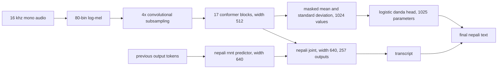

# architecture

kriti is a nepali-only rnnt deployment derived from the mit-licensed
[ai4bharat nepali indicconformer](https://huggingface.co/ai4bharat/indicconformer_stt_ne_hybrid_ctc_rnnt_large).
the release removes the ctc decoder and 21 non-nepali rnnt joint heads, compacts
the prediction embedding at load time, and adds a portable acoustic terminal
punctuation head. [references.md](references.md) records the upstream model,
runtime, and architecture foundations used by this graph.

## signal front end

- input is mono audio sampled at 16 khz.
- the front end computes 80 log-mel bins with a 25 ms hann window, 10 ms hop,
  512 point fft, per-feature normalization, and 0.00001 dither.
- strided convolution reduces the time axis by a factor of four.

## conformer encoder

- 17 conformer blocks use model width 512 and eight relative-position attention
  heads.
- each block uses feed-forward expansion factor four and a convolution kernel
  of 31.
- attention is full context. encoder and attention dropout are 0.1 in the
  training configuration and inactive for inference.

## rnnt decoder

- the prediction network is a one-layer recurrent network with hidden width
  640.
- the joint network combines the 512-wide encoder state and 640-wide prediction
  state in a 640-wide relu projection.
- only the nepali joint head remains. its 256 sentencepiece units plus blank
  define 257 output rows.
- the archive retains the loader-compatible multilingual prediction embedding.
  `kriti.load_model` copies the first 257 rows into a compact embedding and then
  verifies the live asr graph has exactly 119,461,121 parameters.

## acoustic danda head

the frozen encoder output is pooled with a masked mean and standard deviation,
producing 1,024 features. a binary logistic layer with 1,024 coefficients and
one intercept estimates whether terminal devanagari danda should be appended.
the frozen threshold is 0.711. the portable json head contains numeric values,
in a runtime-independent representation. together, the asr graph and head
contain 119,462,146 live parameters. the loader extracts these features from
the fresh model before rnnt transcription, using duration-sorted batches and
then restoring input order.

## package identity

| artifact | bytes | sha-256 |
|---|---:|---|
| `kriti.nemo` | 497,766,400 | `0144854f0cc78f4b6115b75089fad632c39207d5256e53f92da996b9bbe43582` |
| `punctuation_head.json` | 20,990 | `5874b6fc6b4f1172dffa249a42f5054ffe196cff9b97854fe180eafc4134e9bb` |

the archive loads as 122,901,761 asr parameters before the runtime embedding
compaction. the public loader rejects unexpected artifact hashes, head shapes,
joint heads, vocabulary sizes, and live parameter counts.
